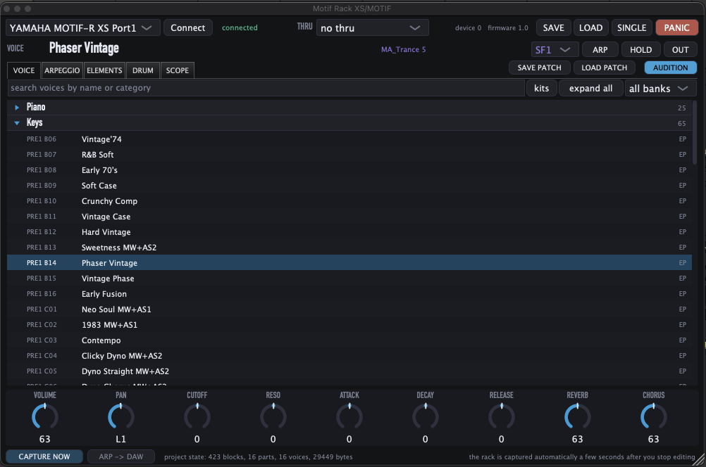
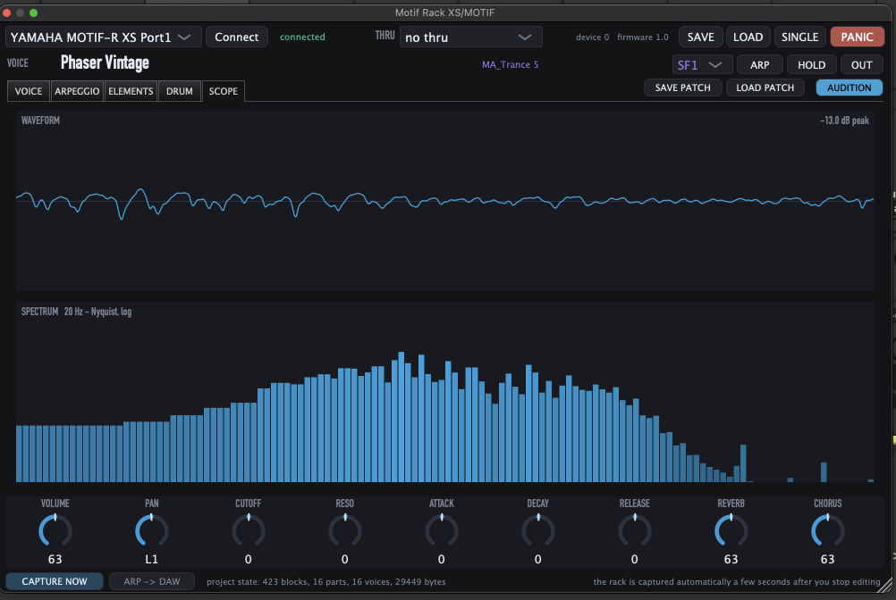

# MOTIF-RACK XS Editor

A native macOS editor and controller for the Yamaha MOTIF-RACK XS consisting of
a command line tool, a standalone app, and a VST3/AU plugin.

Obviously, you need a Yamaha XS Rack for this to be of any use. Nothing here
emulates the rack or samples it. All the audio comes out of the hardware; this
drives it, so the rack behaves like a modern, total-recall synth inside Ableton
Live instead of a box you walk over to and program.

**Status: done and in daily use.** The plugin passes Apple's `auval` and
`pluginval` at strictness 7. It stores the rack's whole rig in the Live project,
the Multi and all 16 part voices, and puts it back when the project reopens.



## Why

I own this rack, and it is still a serious instrument.

**1217 factory voices across 17 categories, and they are properly made.** Not
filler. Yamaha built these when they were still shipping flagship workstations,
and the pianos, the electric pianos, the pads and the analogue emulations hold
up against anything I could buy today.

**The arpeggiator is the part people miss.** 6633 patterns, not simple
up-down-random ones but recorded phrases: 1909 drum and percussion, 984 bass,
654 plucked guitar, 607 muted guitar, plus sequences, hybrids and control
patterns. 1012 of them carry random SFX variation, and there are 6/8, 3/4 and
9/8 patterns in there alongside the 4/4. Each part holds **five of them at once**
on SF1 to SF5, switchable while you play, so one part carries a performance
rather than a riff.

What it never had was any way to live in a modern session. The editor Yamaha
shipped is a PowerPC-era relic. mLAN is dead. Every patch change means walking
over to the rack.

So the rig ends up outside the project. You save a session, come back a month
later, and the rack is on whatever you left it on. I wanted total recall in
Ableton Live, and that is what this does.

It is harder than it sounds. A Multi only stores a *reference* to each part's
patch, so restoring one brings back the factory patch and silently throws away
every edit you made to it. This captures the Multi and all 16 part edit buffers,
423 blocks and about 29 kB, so the session comes back the way you left it.

Everything else grew out of that.



The scope reads whatever audio reaches the track, so you can see the rack you
are editing. In the standalone app you pick the interface *and* the stereo pair,
because a rack on an 18-input desk is rarely on channels 1 and 2.

## Design

**The core knows nothing about UI, JUCE or VST.** `motif-xs-core` is portable
C++20 with one platform file. The CLI, app and plugin are thin shells over it.

**Parameters are data, not code.** 1136 parameters live in `data/parameters.json`
with address, size, encoding and range, generated into a C++ table. There is no
SysEx byte array anywhere in the source. Adding a device means adding a table,
not a code path.

**One client at a time, enforced.** The rack has a single MIDI port and no
arbitration, and CoreMIDI merges the output of every client that opens a
destination. A second client's messages land inside the first one's bulk
transfer and the rack rejects the sequence. Opening the rack takes an exclusive
file lock and a second client is refused by name.

**A capture has to be restorable before it can be saved.** The Multi needs its
header, its footer and all 16 part blocks; a voice needs its Common block.
Anything short is refused at both ends and never written into a project. A
capture that only half arrived is worse than none at all: it looks fine, it
replaces the good one, and it fails weeks later when you reopen the session.

```
motif-xs-core/     C++20 core. No JUCE, no UI, no VST
motif-xs-cli/      motifxs command line tool
motif-xs-app/      standalone app
motif-xs-plugin/   VST3 / AU
data/              catalogs extracted from Yamaha's documentation
docs/              protocol and architecture notes
tools/             extraction and code generation
tests/             core and plugin tests, no hardware needed
```

Architecture notes are in `docs/`: `protocol.md`, `address-map.md`,
`state-sync.md`, `voice-architecture.md`, `drum-architecture.md`,
`arp-architecture.md`, `multi-architecture.md`, `vst-architecture.md`,
`midi-routing.md`.

## Method

Published specification → hardware experiment → captured behaviour →
implementation. No reverse engineering of Yamaha binaries. The PDFs are the
authority, and every claim in `docs/` is either cited to them or marked
verified or contradicted on hardware.

That last part matters more than it sounds.

## What the documentation gets wrong

Yamaha's Data List is good. It is not correct. Five errors, all found by reading
addresses back off the rack, all of which fail *silently*: the unit ignores
the message or returns nothing, which looks exactly like a reserved address.

1. **Identity Request is not omni.** The Data List says the unit receives under
   omni. `F0 7E 7F 06 01 F7` gets no reply. Only the explicit device-number form
   works, so discovery has to sweep 0–15.
2. **Mode Change is at `0A 00 01`**, not the `0A 00 00` printed in the p62
   memory map. That is the block base, not the parameter.
3. **Multi Part Program Number is 0-based**, not the documented "1 – 128".
   Converting to be safe is what gives you the off-by-one.
4. **The Audio In Part's mid byte is fixed at `41`**, though the table prints it
   as the part variable `pp`.
5. **Bank Select and Program Change receive can be off** (`00 00 14`, `00 00
   15`). My unit shipped with both off, so every patch change was ignored with
   no error anywhere. `motifxs` warns about it now.

Corrections live in `data/parameters_corrections.json`.

### A gap closed by experiment

Yamaha lists Sequencer Setup (`00 05 00`) as a 22-byte bulk block and publishes
no parameter table for it. I probed all 22 addresses. Exactly two answer:
`00 05 0B` **MIDI Sync** and `00 05 0C` **MIDI Clock Out**, confirmed by panel
reading, value-range fingerprinting, and the Quick Setup block's ordering. They
are in `data/parameters_discovered.json`, flagged `source: "hardware"`.

## Testing

### Addresses verified against hardware

Every concrete address read from the rack, reply length compared to the
documented size:

| Scope | Addresses exact | Size mismatches | Unexplained silence |
|---|---|---|---|
| System | 73 | 0 | 0 |
| Normal Voice Common | 236 | 0 | 0 |
| Normal Voice Element | 130 | 0 | 0 |
| Drum Voice Common | 186 | 0 | 0 |
| Drum Voice Key | 32 | 0 | 0 |
| Multi Common | 106 | 0 | 0 |
| Multi Part | 96 | 0 | 0 |
| **Total** | **859** | **0** | **0** |

Also verified end to end: 10 of 10 randomly sampled voice names read back match
the catalog, arpeggio numbers 1, 3861 and 6633 round-trip through the 2-byte
encoding, and all 16 parts resolve bank and program to real voice names.

### Four layers

```sh
./build/motif-xs-tests            # core: encoding, parsing, catalogs
./build/motif-xs-plugin-tests     # plugin, headless — no DAW, no rack needed
tools/validate-plugin.sh          # host validation: auval, pluginval
./build/motifxs soak 10           # the rack itself
```

The plugin tests drive the real processor without a host. Each group is banked
from a failure that actually happened and says which one: a state that cannot
be restored, a bad capture written back into a project, the device opened twice,
the arpeggiator relay feeding itself, macros bound to nothing, audio silently
cleared. Where reproducing a bug would need a rack plugged in, the assertion is
made against the source instead, which pins the shape that regressed without
making the suite depend on what is connected.

The hardware group at the end **skips out loud** when no rack is present. A
missing instrument has to look missing; nothing here quietly passes on a
simulated one.

### Soak test

Unit tests cover encoding. The rack covers the rest.

```sh
motifxs soak 10
```

Each round puts a random voice on a random part, makes random edits and reads
every one back, fires a burst of a dozen or more patch changes at arrow-key
speed, then captures. Every other round it restores what it just captured and
captures again. The two agree block for block, or the test names what drifted.
It captures your Multi first, restores it at the end, and verifies that too.

```
rounds           : 10
writes verified  : 60  (0 disagreed)
captures         : 10  (0 failed)
round-trip drift : 0 blocks
restored to start: yes, identical
result           : PASS
```

Every bug that mattered here only showed up against hardware under load. The
worst one opened the rack twice, so every MIDI packet arrived twice and spliced
bulk transfers into nonsense: 209-byte messages where the largest real block is
107. Remove the fix and the soak test catches it in two rounds.

## Requirements

| | |
|---|---|
| Platform | macOS, universal (Apple Silicon + Intel) |
| Hardware | Yamaha MOTIF-RACK XS over USB |
| Build | CMake 3.21+, C++20; JUCE 8 for the app and plugin |

**Windows is coming.** The whole project is portable C++20 except
`motif-xs-core/src/device.cpp`, which is CoreMIDI. One file behind the `Device`
interface, no changes anywhere else. I'm building a Windows host with the
tooling on it so this gets tested properly rather than shipped blind.

Binaries here are unsigned, so Gatekeeper will block them on any Mac other than
the one that built them until you allow it in System Settings → Privacy &
Security. Building from source avoids that.

## Build

Core, CLI and tests need nothing but CMake and a compiler:

```sh
cmake -S . -B build -DCMAKE_BUILD_TYPE=Release
cmake --build build -j8
./build/motif-xs-tests
```

The app and plugin need JUCE, which is not vendored:

```sh
git clone --depth 1 --branch 8.0.4 https://github.com/juce-framework/JUCE.git external/JUCE
cmake -S . -B build -DCMAKE_BUILD_TYPE=Release
cmake --build build -j8
```

CMake skips those targets if `external/JUCE` is absent.

Two traps worth knowing. `CMAKE_OSX_ARCHITECTURES` must be set *before*
`project()`. Afterwards the cache entry exists and a non-`FORCE` `set()` is
ignored, and a Homebrew CMake under Rosetta then quietly builds Intel binaries
on Apple Silicon. And after a macOS major upgrade, `xcode-select` can point at
an Xcode too old for the new OS, at which point `git` and `clang` both fail with
`Symbol not found: _XPCTypeBool`; `sudo xcode-select -s
/Library/Developer/CommandLineTools` fixes it.

## Use

```sh
motifxs list-midi          # find the rack
motifxs identify           # device number and firmware
motifxs status             # mode, edit buffer, voice name
motifxs voices bass        # search 1217 voices
motifxs patch 1 PRE1 42    # put a voice on a part
motifxs save rig.motifxs   # capture the whole rig
motifxs load rig.motifxs   # put it back
motifxs soak 10            # hardware test
motifxs panic              # all notes off, arp cleared
```

The app auto-connects to Port1 and reads the rack's live state.

* Voice browser — 1217 voices in collapsible categories, searchable, bank filter
* Arp browser — 6633 patterns filtered by text, category, metre and tempo,
  assignable to any of the part's five SF slots
* Nine PERFORM macros bound to Multi Part offsets, so they move all eight
  elements together the way the rack's own knobs do
* **SAVE / LOAD** — the whole rig to a file, Multi and all 16 part voices
* **SAVE PATCH / LOAD PATCH** — an edited voice lives in a part's edit buffer
  and dies at the next patch change. Save it whole, put it on any part. The rack
  manages 16 of these, and only inside one Multi. As files they are unlimited.
* **THRU** — forward the arpeggiator to another instrument
* **ARP → DAW** — relay the arpeggiator into the host track, no IAC bus needed
* **PANIC** — all notes off, arp switch and hold cleared on all 16 parts
* **SCOPE** — waveform and log-spaced spectrum. In the app, pick the interface
  *and* the stereo pair; a rack on an 18-input desk is rarely on 1/2

### Single and Multi

The rack is always in Multi. That is how the edit buffers are addressed and
what gets captured, so all 16 parts are always there and always saved. SINGLE,
the default, just hides the part strip and shows the one you play. MULTI brings
it back. Automation is unaffected either way.

### In Ableton Live

One track. Put the plugin **after** the External Instrument so it sees the
returning audio for the scope, and so the ARP → DAW relay does not run back into
the rack. The plugin captures the rig a few seconds after you stop editing, and
restores it when the project reopens. Press **CAPTURE NOW** before the first
save to seed it.

If the relay does loop, the plugin shuts it off and says so rather than letting
it run.

## Data

Extracted from Yamaha's published documentation, not from any binary.

| File | Contents |
|---|---|
| `data/parameters.json` | 1136 parameters across 10 scopes |
| `data/voices.json` | 1217 factory voices with bank, MSB/LSB, program, category |
| `data/arpeggios.json` | 6633 arpeggio types with category, tempo, metre, flags |

```sh
python3 tools/extract_parameters.py && python3 tools/build_parameters.py
python3 tools/extract_voices.py
python3 tools/extract_arpeggios.py
python3 tools/gen_tables.py
```

The PDFs are not redistributed; they are in `.gitignore`. Every file under
`data/` regenerates from your own copy, which is also how you would check my
work.

## Known issue

Entering Multi mode over SysEx does not work on my unit. Writes of every
documented value to both candidate addresses are accepted and then do nothing,
while the front panel button works fine. Leave the rack in Multi, which
`Power on Mode = multi` makes permanent.

## Contributing

The most useful thing anyone could add is **another device**. The parameter
model is data-driven, so a MOTIF XS or XF keyboard is mostly a matter of
extracting its Data List and confirming the model ID and address map against
hardware. The tools in `tools/` are written to be pointed at a different PDF.

Second most useful: the Windows MIDI backend, if you beat me to it.

Keep the discipline either way. Read every address back off the real
instrument before writing it down, and mark what the documentation gets wrong.
It gets things wrong more than you would expect.

## Licence

**AGPL-3.0**, because this links JUCE, which is dual-licensed AGPLv3 or
commercial. If you build on this, your work inherits those terms. The VST3 SDK
has been MIT since late 2025, so it imposes nothing of its own.

MOTIF-RACK XS, MOTIF and Yamaha are trademarks of Yamaha Corporation. This
project is not affiliated with or endorsed by Yamaha.
